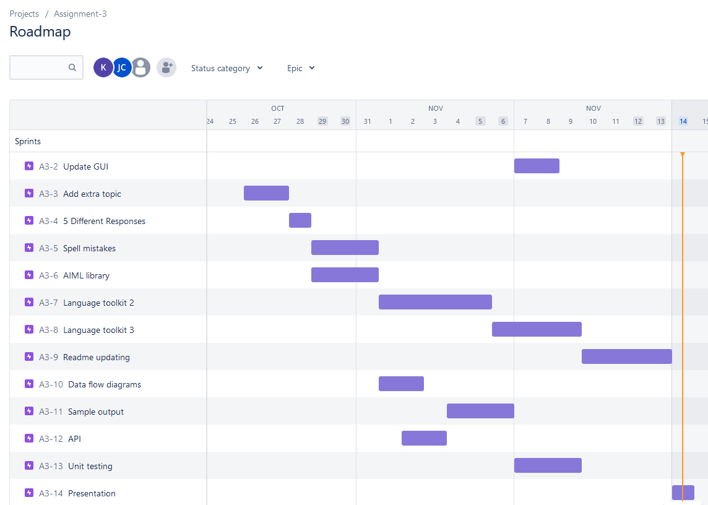
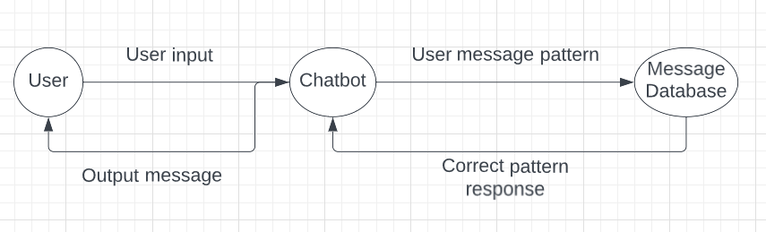
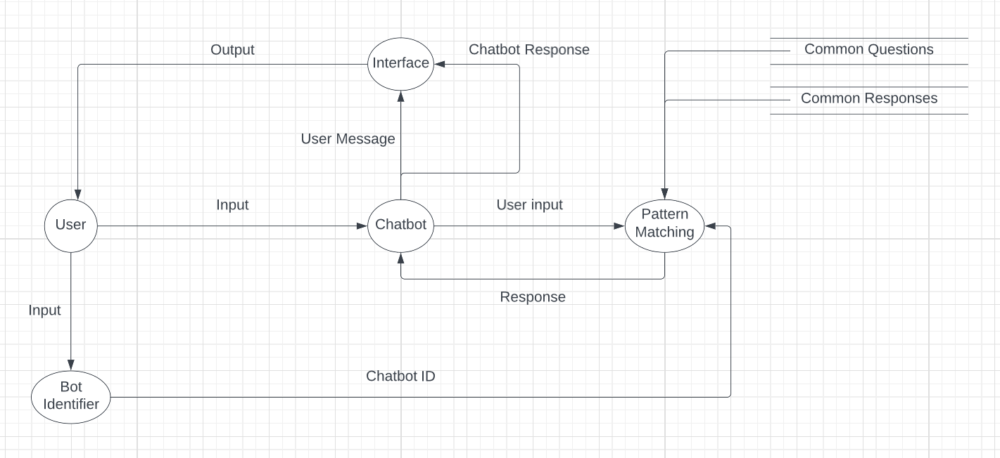
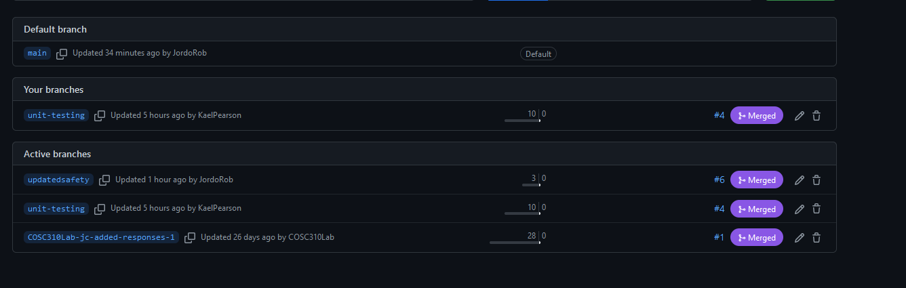
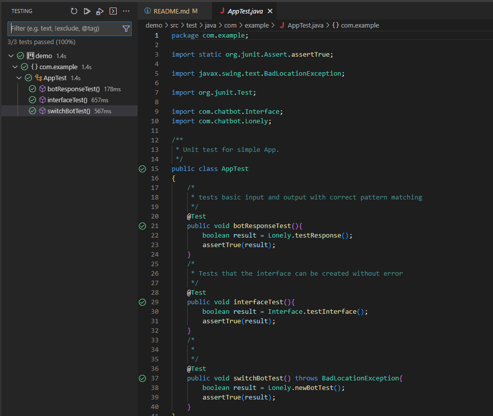
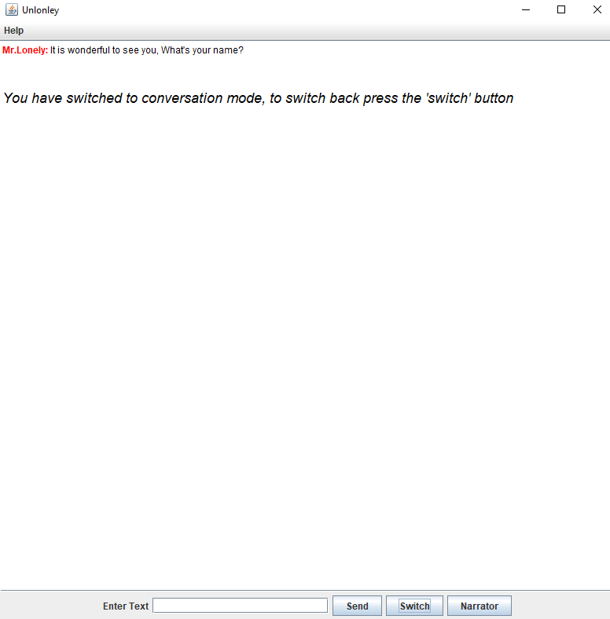
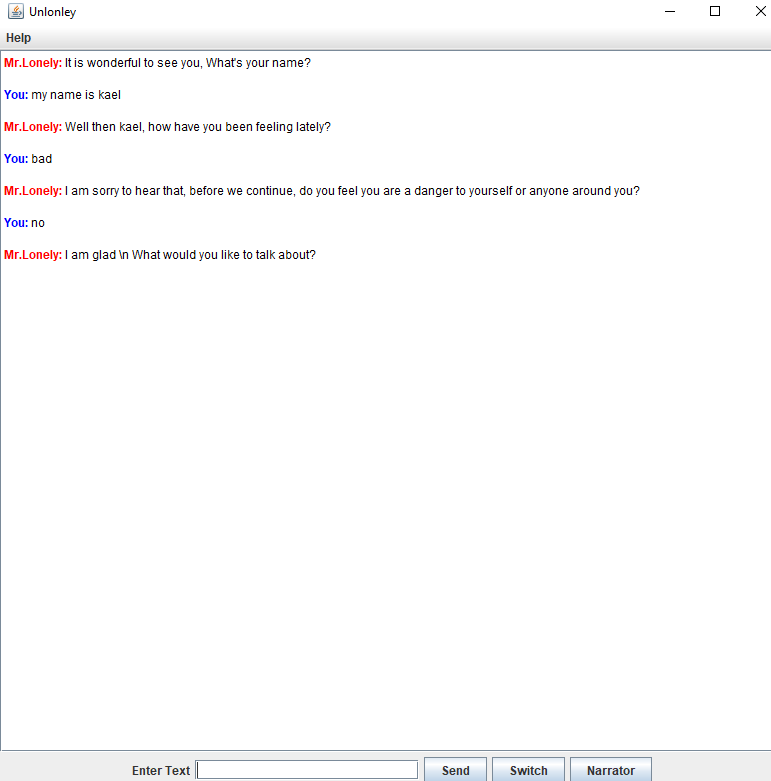

# **310 Lab Group 13**
# Assignment 3:
## **Description:**

### Chatbot description:
    We have now made the chatbot incredibly more robust, previously it had a hard time recognizing any mistakes or text outside it's incredibly limited scope. It is now able to recognize most different forms of text and can handle most of them. It is able to answer questions far outside the scope of the project and can hold a fairly stable conversation.

### Limitations
- Needs more responses
- Bot doesn't always know how to match the pattern

### Buffet items: 
- We switched our code over to using AIML library, utilizing existing language recognition tools and simple conversation
- We had previously already created UI, so we decided to just make updates to make it more visually appealing
- We added another topic by adding a seperate bot that can determine more things that are found in most conversations
- Our chatbot can give over 5 different responses outside the two topics as well as it has a large dataset
- Implemented a Text to Speech library called FreeTTS

### JIRA

### Data flow diagrams
- Level 0
  - 
  - User inputs to chatbot and chatbot checks on message database for the correct reponse
- Level 1
  - 
  - User input determines chatbotID which changes what patterns it is supposed to understand. After input chatbot determines correct response and delivers it to the interface which shows it to the user.

### Github Charts
- Branches
    - 

### Unit Testing

### API Features
- User input
- Output
- Current chatbot ID
- Datasets
- Test cases and checks
  
### New Features/Updates:

- Used AIML library to create two bots (or more).
    - This allowed us to start the conversation with questions relating to safety where afterwards it switches to conversation mode if safety is determined. This could also be used to create more specialized bots in the future.

- Used AIML alicebot for the default conversation (an open source AI project) that allowed us to utilize a massive library of pre-programmed responses.
    - This made it much easier to streamline the conversation aspect of the project, making us able to focus more on the safety features.

  
- Made the code much more organized, utilizing OOB principles and seperating it into classes and subclasses
    - This is self-explanatory but it makes the code much easier to work on and allows for easier debugging/updates, also made our method of switching bot libraries easier.

- Added Text to speach narrator (FreeTTS)
    - Allowed more users to access the program and offers a unique experience with a chatbot.

    

