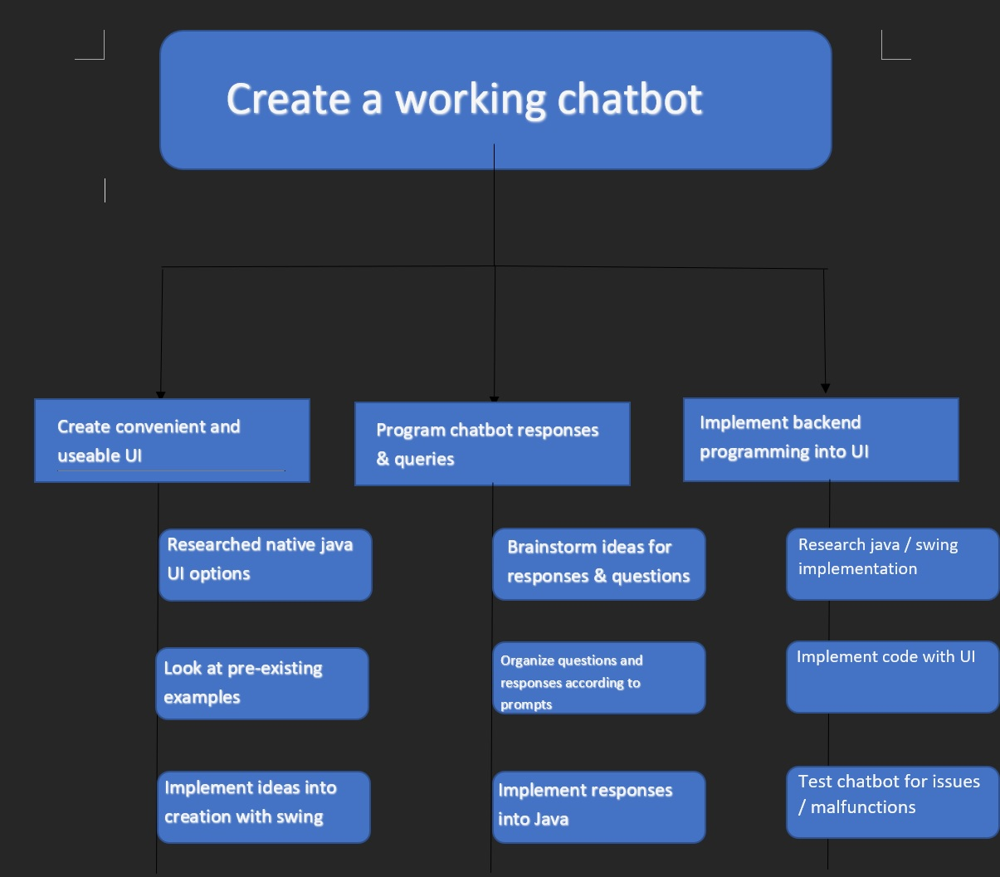
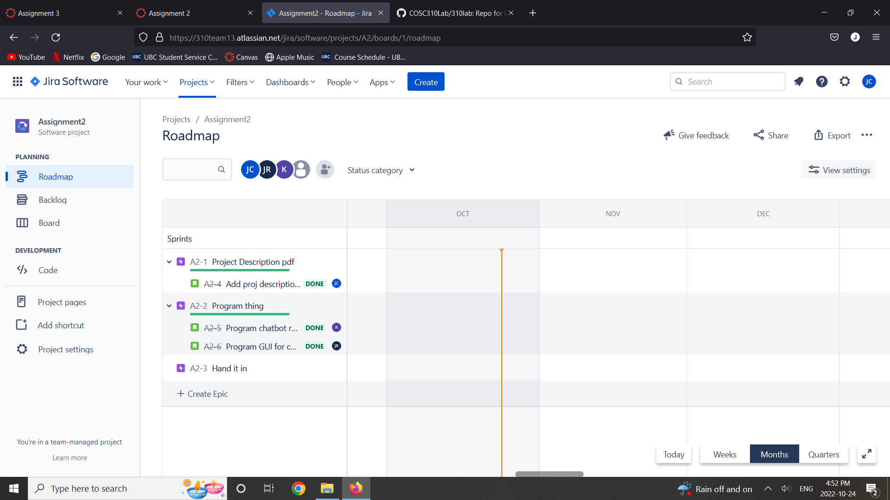

# 310 Lab Group 13
## **Assignment 2:**
### **Description:**
We are creating a chatbot with a focus on users who are experiencing loneliness. It will have a UI and respond to user accordingly. It will also have a detected risk level and from that can inform the user if they are in danger from themselves. We plan on using swing for java to create a simplistic UI to begin with.
### **Chosen SDLC:**

We chose to use Agile Scrum as it will allow us to work quickly through a feature and then go back and choose to work on something else. This will work better than other SDLC for us because we will operate much quicker when working on one feature together and can help figure out problems faster.

### **Phases of the SDLC:**

- Outline planning phase
    - Figure out limitations
        - What can we get accomplished and what needs more time
        - How long will each task take
    - Choose programming language 
        - Choose what language that can make an easy UI
        - Figure out all our teams skills in each language
    - Project plan
        - Creating github and project management tools

- Sprint Cycles
    - Plan
        - Make list of needed features
        - Choose highest priority feature to develop
    - Create
        - Develop feature
    - Review
        - Test features
        - Refactor if necessary
        - Write Documentation

- Closure
    - Documentation
        - Write documentation so future developers can understand
        - If needed user manuals
    - Assess project
        - What lessons have been learned from the project
    - What can be improved
        - For later use in individual projects

### **Task Assignments:**
-	UI Creation (Jordan)
    -	Hour Estimation: 4 hours
    -   Actual Hours: 2.5 hours

-   Chatbot Programming (Kael)
    -	Hour Estimation: 2 hours
    -	Actual Hours: 3 hours

-	Chatbot Programming (Jack)
    -	Hour Estimation: 2 hours
    -	Actual Hours: 3 hours

-	Chatbot Programming (Jordan)
    -	Hour Estimation: 2 hours
    -	Actual Hours: 3 hours

-	Gantt Chart Creation (Jordan)
    -	Hour Estimation: 2 hours
    -	Actual Hours: 1 hour

-	WBS Creation (Jack)
    -	Hour Estimation: 2 hours
    -	Actual Hours: 2 hours

-	Code Testing (Jordan, Kael, Jack)
    -	Hour Estimation: 2 hours
    -	Actual Hours: 2 hours

### **Limitations of the project**

- Can only respond to certain messages
- Messages must be simple as the bot only knows keywords
- Can only respond with canned responses
- Bot eventually stops where you can only repeat what you've done already
- Current prototype does not provide actual contact information of mental health professionals

## **Charts and Structures:**
[Gant Chart](https://app.asana.com/read-only/COSC310-Assignment-2-(CHATBOT)/1191351854255875/b44a2272681556ed28b269e3abf307dd/timeline)

WBS

JIRA

